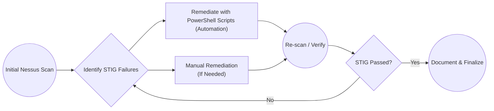

# Windows 10 STIG Remediation Repository

Welcome to my **Windows 10 STIG v3r2** remediation project! This repository documents how I systematically remediated STIG findings from an initial Tenable Nessus STIG scan on a Windows 10 Azure VM.

## Table of Contents

1. [Project Overview](#project-overview)
2. [Top 10 STIG Remediations](#top-10-stig-remediations)
3. [Remediation Workflow](#remediation-workflow)
4. [Scripts Folder](#scripts-folder)
5. [Sub-Pages / Documentation](#sub-pages--documentation)
6. [Initial Nessus Scan Results](#initial-nessus-scan-results)

---

## Project Overview

- **Purpose**: Demonstrate the practical process of scanning a Windows 10 system with Nessus, identifying STIG findings, remediating them with PowerShell or manual configuration, and verifying the result.
- **Scope**: Focus on the DISA Windows 10 STIG v3r2 controls.

## Top 10 STIG Remediations

This table briefly lists my top 10 priority controls (based on severity, exploitability, and minimal user disruption). Each links to a more detailed page in the `docs/` folder.

| STIG ID(s)                      | Summary                                                 | Link                                                         |
|---------------------------------|---------------------------------------------------------|--------------------------------------------------------------|
| WN10-AU-000500/-000505/-000510  | Increase event log sizes to meet STIG thresholds        | [Event Log Sizes](./docs/STIG-EventLogSizes.md)             |
| WN10-00-000155                  | Disable Windows PowerShell 2.0                          | *(link to future doc)*                                       |
| WN10-00-000031 / -000032        | Enable BitLocker with Pre-Boot PIN (≥6 digits)          | *(link to future doc)*                                       |
| WN10-AC-000005 / -000010 / -000015 | Enforce account lockout policy (3 attempts, 15 min lock) | *(link to future doc)*                                    |
| WN10-AC-000035 / -000040        | Require 14+ character passwords, enable complexity      | *(link to future doc)*                                       |
| WN10-CC-000180 / -000185 / -000190 | Disable AutoPlay/AutoRun for all drives               | *(link to future doc)*                                       |
| WN10-00-000145                  | Enable Data Execution Prevention (DEP) in “OptOut” mode | *(link to future doc)*                                       |
| WN10-00-000150                  | Enable Structured Exception Handling Overwrite Protection (SEHOP) | *(link to future doc)*                       |
| WN10-CC-000038                  | Disable WDigest authentication                          | *(link to future doc)*                                       |
| WN10-AU-AdvancedAuditing        | Configure advanced auditing (process creation, credential validation, etc.) | *(link to future doc)*                |

## Remediation Workflow

Below is the general workflow I use:

1. **Scan** the system with Tenable Nessus STIG policy.
2. **Identify** failed STIG items.
3. **Remediate** using PowerShell scripts or manual steps.
4. **Verify** success by rescanning.

## Scripts Folder

All PowerShell scripts are in the [`scripts/`](./scripts) folder. Each script is thoroughly commented with usage instructions.

- **Set-STIG-EventLogSizes-GPO.ps1**: Automates WN10-AU-000500, 505, 510 requirements for event logs.  
- *(Add more scripts as you go.)*

## Sub-Pages / Documentation

For detailed breakdowns of each STIG item, see the [`docs/`](./docs) folder. Each page includes:
- The problem statement/vulnerability,
- Manual vs. automated remediation steps,
- Testing/verification screenshots,
- Rollback instructions (if needed).

### Example Sub-Page

- [Event Log Sizes (WN10-AU-000500, -000505, -000510)](./docs/STIG-EventLogSizes.md)

## Initial Nessus Scan Results

Below is a snippet or screenshot of my baseline Nessus scan showing various failures:

## Initial STIG Scan
For the original Nessus scan results (showing the baseline STIG failures), see:
[Baseline-STIG-Scan.pdf](./reports/Baseline-STIG-Scan.pdf)

---

*Thank you for visiting! I hope this project helps illustrate how to methodically address STIG findings.*
